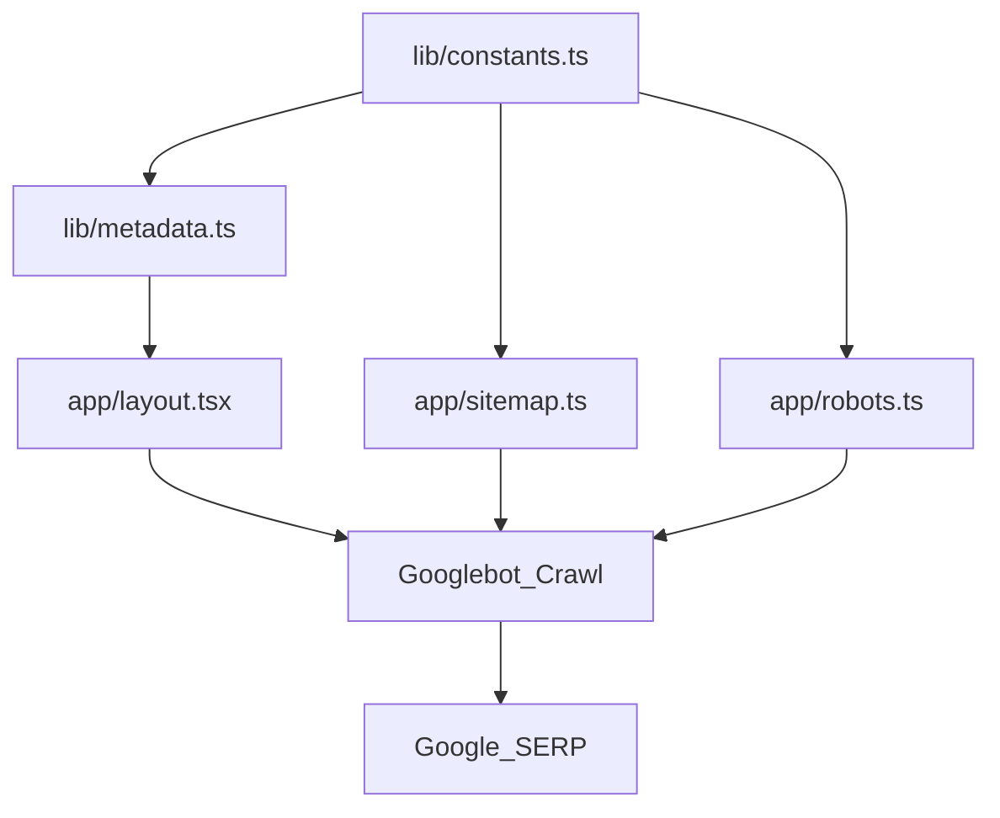

# SEO module docs: `lib/metadata.ts` + site-wide SEO sources

This module controls **canonical URLs**, **OpenGraph/Twitter cards**, and the **global JSON-LD graph** injected from `app/layout.tsx`.

## Single source of truth (canonical domain)

All SEO URLs must derive from:

- `BUSINESS_INFO.website` in `lib/constants.ts`

If the domain changes again, update **only** `BUSINESS_INFO.website` and rebuild/deploy.

## What `generateMetadata()` does

`generateMetadata()` in `lib/metadata.ts` is used by:

- `app/layout.tsx` (global metadata)
- page routes that export `metadata` (example: `app/about/page.tsx`)

It ensures:

- A stable canonical URL from the `path` parameter
- `metadataBase` set to the canonical domain
- OpenGraph/Twitter URLs align with the canonical

## Structured data (JSON-LD)

Global JSON-LD is injected in `app/layout.tsx` as a `@graph` containing:

- `WebSite`
- `Organization`
- `LocalBusiness`
- `LodgingBusiness`

Page-specific JSON-LD should be injected per page (example: `app/sri-janki-mahal-ayodhya/page.tsx`) so that:

- FAQs can be declared as `FAQPage`
- Breadcrumbs can be declared as `BreadcrumbList`
- Each important page can declare a `WebPage` entity

## Ratings policy (important)

Avoid adding star ratings (`AggregateRating`, `Rating`, etc.) unless you can back them with a **public, verifiable** review source. Incorrect rating markup can cause rich-result penalties.

## Flowchart (how SEO is produced)

## Debugging checklist

- Confirm canonical URLs on each page match the new domain.
- Confirm `robots.txt` points at the new sitemap URL.
- Confirm `sitemap.xml` contains the new landing page URLs.
- In Google Search Console:
  - Submit `sitemap.xml`
  - Inspect `/` and `/sri-janki-mahal-ayodhya/`

